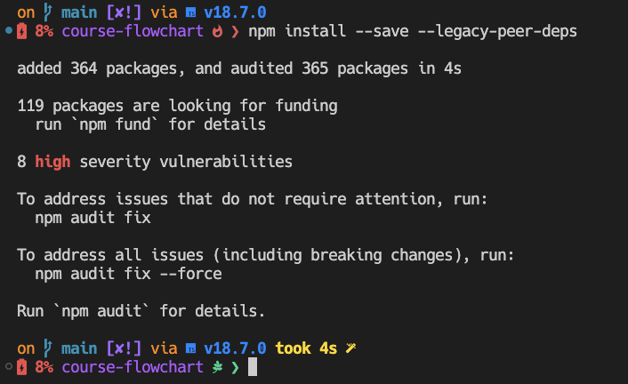
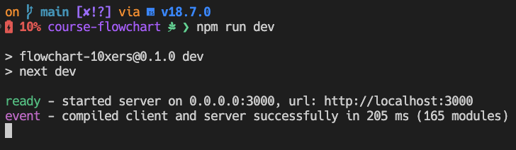
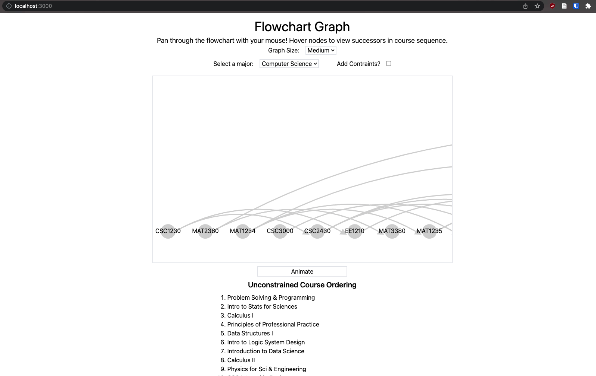
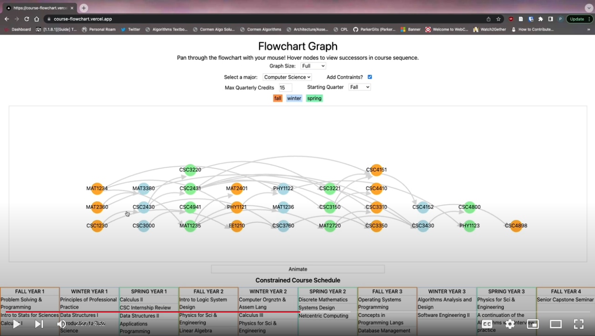

# Creating a Flowchart from a Dependency List

A work by Parker Landon and Colby Nelson

This project comprises a web application that computes and visualizes course schedules using graphs.

The web application is deployed and working at [https://course-flowchart.vercel.app/](https://course-flowchart.vercel.app/).

A walkthrough of the application detailing its features and how to run it locally is available [here on YouTube](https://www.youtube.com/watch?v=eYeJLFD2vSc).

The program implements algorithms and concepts from CSC 3430 like adjacency list graphs for representing relationships between courses, topological ordering for unconstrained course orderings, and greedy algorithms for constrained course schedules.

The graph visualization is created using the React and react-d3-graph libraries. The application also implements an "animation" feature that visualizes a step-by-step construction of the course schedule.

## Description

This application constructs a graph from major requirements and computes recommended schedules for taking those courses. The major requirements are encoded as JSON files. The program reads and parses `src/data/majors/major1.json` and `src/data/majors/major2.json` to create a list of courses, then constructs a graph for each major from the required courses' prerequisites.

The unconstrained course ordering for a major is computed by a topological ordering algorithm on the course-requirement graph.

The constrained course schedule is computed from the unconstrained course ordering via a greedy algorithm. An overview of this algorithm is detailed in [Parker's Reflection](#parkers-reflection).

The application employs Next.js, React, Tailwind, and react-d3-graph to visualize the graphs and course schedules in the browser. We also used TypeScript, ESLint, and Prettier for static analysis.

## Requirements

To run this application locally, you will need Node.js and npm installed. The application uses several libraries, all of which are listed in `package.json`. With npm, you can quickly install these packages.

For installing Node.js and npm on Ubuntu (citing [How to Install Node.js on Ubuntu 20.04](https://www.digitalocean.com/community/tutorials/how-to-install-node-js-on-ubuntu-20-04#option-1-installing-node-js-with-apt-from-the-default-repositories)):

Refresh local package index:

```zsh
$ sudo apt update
```

Install Node.js:

```zsh
$ sudo apt install nodejs
```

Install was successful if version query returns version number:

```zsh
$ node -v
```

Now install npm:

```zsh
$ sudo apt install npm
```

Version query for npm should now return the version number:

```zsh
$ npm -v
```

## User Manual

Once Node.js and npm are installed, the following steps will guide you to run the application in a local development environment.

First, clone the repository.

```zsh
$ git clone https://github.com/csc3430-winter2023/flowchart-10xers.git
```

Then, change into the new directory.

```zsh
$ cd flowchart-10xers/
```

Now, we need to install the requisite packages via npm. We use the `--legacy-peer-deps` flag to reconcile the peer dependencies of the graph library.

```zsh
$ npm install --save --legacy-peer-deps
```



Finally, we can start the development environment:

```zsh
$ npm run dev
```



The development server should be running on `localhost:3000`.

```zsh
$ open http://localhost:3000
```



Once you have accessed the running application in your browser, you are ready to begin using it! Follow the intuitive user interface to start selecting majors and constraints, or check out [this YouTube video](https://www.youtube.com/watch?v=eYeJLFD2vSc) for a walkthrough of using the app.

[](https://www.youtube.com/watch?v=eYeJLFD2vSc)

## Reflection

### Colby's Reflection

This was a fun project to do because it had a lot of relevance to students at SPU and could be a very useful tool for students to use with a little more polish. Parker and I have never worked together before, but Parker may be one of the best group members I have had in group projects. As you know I struggled with Algorithms and had to focus a lot of my time on studying for the final. Parker was incredibly understanding and worked hard to make sure that I completed tasks. When I was unable to complete tasks, he picked up the slack. We learned most of the information needed for this project in class, so it was cool and enjoyable to apply what we had learned in class to a real-world application. Finally, I am not the best at web development and Parker is a solid web developer, and I got some more practice in web development thanks to our chosen strategy for deployment.

### Parker's Reflection

The first step in the development process was to read the major requirements from file into memory. Because JavaScript has a built-in JSON parse function, we determined it would be easiest to use JSON to represent the major requirements. Our application parses and validates JSON files during build-time using the `readMajors` function (`src/utils/readMajors.ts`). One can add a major to the application by creating a JSON file of requirements in `src/data/majors` and adding the file name to the `files` object in `src/utils/readMajors.ts`.

Next, we needed to construct the graph for each major in memory. Colby and I both had experience building graphs thanks to the extra credit graph library assignment, so we opted to make our own `Graph` class (`src/models/graph.ts`) instead of reaching out for an open-source library. The major requirements make for sparse graphs, so we determined that an adjacency list graph representation would be more efficient than an adjacency matrix. Because the graphs are constructed from file inputs and are otherwise immutable, the `Graph` constructor can immediately compute the graph's topological ordering and store it as a data member. This way, we only need to compute the topological ordering for a major once. The topological ordering algorithm we used comes from the O(m+n) algorithm at the end of section 3.6 in the book.

With the graph constructor in place, it was time to visualize the unconstrained ordering. This step entailed assigning x- and y-coordinates to each node based on their positions in the topological ordering. Accomplishing this step marked the completion of the unconstrained ordering feature.

Our next objective was to compute the constrained course schedules. Developing an algorithm for this step proved challenging, but we opted for a greedy approach. The steps of this algorithm are as follows:

1. Take in the graph's topological ordering, the `maxCredits` constraint, and the `startTerm` as inputs.
2. For each course in the topological ordering, compute the number of prerequisites.
3. Group each course by term, producing a map from term to courses.
4. For each term, starting at `startTerm`, iterate through the courses offered during that term. Add the course to the term's schedule if
   1. The course has not already been added to the course schedule
   2. The course has no prerequisites remaining
   3. The existing credits in the term schedule plus the additional credits from this course do not exceed the `maxCredit` constraint
5. For each of the successor courses for which a newly added course is a prerequisite, decrement the number of prerequisites.
6. Add the term schedule to the total course schedule.
7. For animation, store the current state of the term schedule as a "frame."
8. Continue looping through terms until all courses are added to the course schedule.

Step 4 above reveals the greedy aspect of this algorithm: we iterate through courses and myopically add them to the term schedule if they satisfy a set of conditions. An alternative approach would be to use the Subset Sum dynamic programming solution: find the combination of courses that maximizes the credit sum while respecting the maxCredits constraint. However, the Subset Sum solution is pseudo-polynomial and NP-Complete (theorem 8.23 in Kleinberg/Tardos). Thus, while the Subset Sum would afford a more optimized schedule, it would do so inefficiently. In contrast, the greedy algorithm we employed performs a polynomial number of operations with respect to the size of the graph (on the order of _O(m+n)_ where _n_ is the number of courses and _m_ is the number of edges).

After constructing and visualizing the constrained schedule, the remaining task was implementing the graph construction animation. Our approach was to store a "frame" for every iteration of the schedule construction. Each frame represents a snapshot of the schedule at a given time. Then, the graph visualization always displays some "frame" of the animation according to the `animationFrame`. While the visualization is not being animated, the last frame is displayed (`animationFrame = numFrames - 1`). When the "Animate" button is clicked, the visualization initially displays the first frame (`animationFrame = 0`). Then, a series of [setTimeout()](https://developer.mozilla.org/en-US/docs/Web/API/setTimeout) calls increment the `animationFrame`, causing the animation to progress frame-by-frame until `animationFrame = numFrames - 1` again. This mechanism propels the animation.

We quickly discovered while implementing the animation feature that it is computationally expensive. For example, since we were representing the constrained schedule with a two-dimensional array, maintaining each "frame" of the constrained schedule construction required a three-dimensional array. Furthermore, storing a frame for a given point in the schedule construction requires making a copy of the schedule. This operation takes _O(n)_ time (where _n_ is the number of courses in the schedule) and occurs during every iteration of the schedule construction.

To conclude, this project required much ingenuity in choosing data structures, designing algorithms, and creating visualizations with React. Much of our time on this project was spent preplanning our approaches to features like graph visualization, constrained course scheduling, and graph animation. In my above reflection, I have detailed the challenges we faced with algorithm development and the motivations for our presented solutions. We also faced obstacles while visualizing our data on a webpage with React and react-d3-graph. For example, it was troublesome to deal with graph rerenders when the user changed the selected major or schedule constraints. However, solving these problems entailed learning new and insightful features of React. A significant breakthrough in fixing the graph-rerendering problem was discovering the role of React's `key` prop (as detailed concisely [in this blog post](https://tkdodo.eu/blog/putting-props-to-use-state#react-keys)). Overall, this project afforded many learning opportunities, and I look forward to the next time I use a graph while building an application.
To conclude, this project required much ingenuity in choosing data structures, designing algorithms, and creating visualizations with React. Much of our time on this project was spent preplanning our approaches to features like graph visualization, constrained course scheduling, and graph animation. In my above reflection, I have detailed the challenges we faced with algorithm development and the motivations for our presented solutions. We also faced obstacles while visualizing our data on a webpage with React and react-d3-graph. For example, it was troublesome to deal with graph rerenders when the user changed the selected major or schedule constraints. However, solving these problems entailed learning new and insightful features of React. A significant breakthrough in fixing the graph-rerendering problem was discovering the role of React's `key` prop (as detailed concisely in [this blog post](https://tkdodo.eu/blog/putting-props-to-use-state#react-keys)). Overall, this project afforded us many learning opportunities, and I look forward to the next time I use a graph while building an application.
